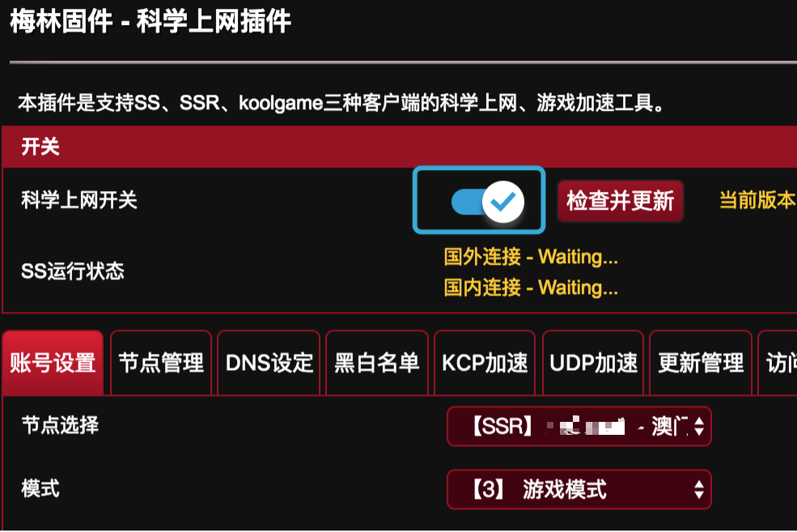

# 路由器

## Koolshare Modified ROM {#koolshare-modified-rom}


收到大量报告，称此客户端存在严重的稳定性与可靠性问题。


### 软件信息

Koolshare 推出的改版固件（多为 Merlin 改版，也存在官方固件改版）中的软件中心提供了 SSR 客户端，使得路由器上可以运行 SSR 客户端，提供网关级别的代理，实现整个路由器下的设备无需配置就可以使用 rixCloud 网络。

但是，由于大部分家用路由器的 CPU 都是 MIPS 或者 ARMv7 架构，同时主频较低，运算性能低下（NAT 大部分有硬件加速因此并不消耗 CPU 性能），导致使用 SSR 的速度可能很慢（平均为不到 50Mbps）。

同时，由于 Koolshare 的更新较多，几乎所有版本都未经代码审计和测试，因此某些版本可能存在严重 Bug 影响使用，导致一天之内更新多次版本，被戏称为 Nightly（每夜更新版）的进阶——Hourly（每小时更新版）

### 测试环境


此软件更新较为频繁且有多个版本，文档中的部分内容可能和实际存在差异。



我们仅在特定平台和版本上进行过测试，并以此撰写文档


`ASUS GT-AC5300  
Koolshare Modified ROM 3.0.0.4.382_15984_koolshare  
KoolSS 1.1.6(Merlin)`

### 注意事项

由于使用 Koolshare Modified ROM（改版固件）的太多是普通家用路由器，其使用的 CPU 大都为 MIPS 或 ARMv7 架构，其性能可能不足，因此使用 KoolSS 可能无法达到较高速率。

目前经过 rixCloud 和 Koolshare 的测试，以下两款路由器使用 Koolshare Modified ROM 的 KoolSS 后可基本达到 200Mbps 的速率：

> ASUS GT-AC5300
>
> ASUS RT-AC86U

如果想要在路由器上达到较高 SS 连接速率，请考虑购买以上两款路由器或购买软路由使用 LEDE

以下是各常见路由型号使用 KoolSS 的大致连接速率：

我们会根据收集到的数据不断更新此表格，但用户提供的数据本身未经验证，仅供参考。你也可以提供你的测试数据，以便协助我们完善此内容。

| 型号 | 品牌 | 大致连接速率 |
| --- | --- | --- | --- | --- | --- | --- | --- | --- | --- | --- | --- | --- | --- | --- | --- | --- | --- | --- | --- | --- | --- | --- | --- | --- | --- |
| R6300v2 | NETGEAR | 60Mbps |
| R6400 | NETGEAR | 30Mbps |
| R6900 | NETGEAR | 60Mbps |
| R7000 | NETGEAR | 80Mbps |
| R8000 | NETGEAR | 未经测试 |
| R8500 | NETGEAR | 110Mbps |
| RT-N66U | ASUS | 未经测试 |
| RT-AC56U | ASUS | 20Mbps |
| RT-AC66U | ASUS | 30Mbps |
| RT-AC68U | ASUS | 60Mbps |
| RT-AC87U | ASUS | 70Mbps |
| RT-AC88U | ASUS | 100Mbps |
| RT-AC86U | ASUS | 200Mbps |
| RT-AC1900P | ASUS | 70Mbps |
| RT-AC3100 | ASUS | 未经测试 |
| RT-AC3200 | ASUS | 未经测试 |
| RT-AC66U-B1 | ASUS | 60Mbps |
| RT-AC5300 | ASUS | 120Mbps |
| GT-AC5300 | 玩家国度 | 250Mbps |
| EA6200 | Linksys | 未经测试 |
| EA6400 | Linksys | 未经测试 |
| EA6700 | Linksys | 未经测试 |
| EA6500v2 | Linksys | 未经测试 |
| EA6900 | Linksys | 未经测试 |
| WRT1900ACS | Linksys | 120Mbps |

（数据提供方表明此数据是通过何种渠道收集的）


以上测试仅供参考，不同服务配置的情况下数值可能存在差异


### 从软件中心安装 KoolSS


安装前可能有额外操作


Koolshare Modified ROM 在使用软件中心前需要先清空并格式化 JFFS2 分区，由于此不属于我们文档应当包含的一部分，因此阁下需要自行前往 Koolshare 社区了解不同机型的不同清除方法。

通过浏览器访问 Koolshare Modified ROM（改版固件） 管理页面。


由于 Koolshare Modified ROM 的页面存在一些兼容性问题，建议使用 Google Chrome 浏览器


在管理页面底部点击「软件中心」，然后点击「未安装」选项卡，然后点击「科学上网」插件来安装。

页面会提示正在安装。

如果安装完成，页面会自动跳转，并可以在「已安装」选项卡下看到此插件。

  
复制订阅地址（关于如何创建订阅[参考教程](https://doc.biwcloud.com/windows#chuang-jian-ding-yue-lian-jie)）

#### [配置 KoolSS](https://docs.rixcloud.us/Routers/Merlin/Guides/?id=%e9%85%8d%e7%bd%ae-koolss) {#配置-koolss}

点击「已安装」选项卡中的「科学上网」插件进入插件管理页面。

如果是第一次使用此插件，则可能弹出此会话框：

点击「订阅节点」按钮进入更新管理页面。

如果没有弹出此会话框，则手动打开 KoolSS 开关并点击「更新管理」选项卡。

进入「更新管理」页面后，滑动页面到下方的「SSR 订阅设置」区域。

在「订阅地址管理」中粘贴我们之前复制的 rixCloud API URI，然后进行如下设定

> 将「订阅节点模式设定」设置为「游戏模式」
>
> 将「订阅节点混淆参数设定」设置为「使用订阅设定」
>
> 将「下载订阅时走 SS 网络」设置为「不走 SS」
>
> 开启「订阅计划任务」，并选择一个你可能不会使用网络的时间。

设置完成后，点击「保存并订阅」按钮。页面会打开一个新的提示框并出现类似下图中的内容：

订阅完成后，页面会自动跳转到主页面，此时 KoolSS 的开关可能将会再次出于关闭状态，点击开关来打开它。

#### [附加设置](https://docs.rixcloud.us/Routers/Merlin/Guides/?id=%e9%99%84%e5%8a%a0%e8%ae%be%e7%bd%ae) {#附加设置}

为了使我们的使用更加舒适，我们需要进行一些附加设置。

点击「更新管理」选项卡，将「规则定时更新任务」设置为「开启」，然后选择一个你可能不会使用网络的时间段。并将所有规则的更新全部勾选，然后点击「保存设置」。

页面将会自动跳转，完成后应当再次返回此页面，然后点击「立即更新」。以确保 KoolSS 已经获取到最新的规则。

点击「DNS 设定」选项卡，然后进行以下设定：

> 将选择国内 DNS 设置为运营商 DNS，如果你的运营商 DNS 存在劫持，则可以使用 `119.29.29.29` 或自定义设置为 `119.28.28.28`
>
> 将「选择国外 DNS」设置为 `ss-tunnel`，然后设置你喜欢的国外公共 DNS 服务提供商

#### [开启 KoolSS](https://docs.rixcloud.us/Routers/Merlin/Guides/?id=%e5%bc%80%e5%90%af-koolss) {#开启-koolss}

完成附加设置后，点击「账号设置」选项卡，选择需要的接入点，然后点击底部的「提交」按钮。KoolSS 将会启动。

一段时间后，页面将会自动刷新并返回到账号设置页面，此时 KoolSS 会自动检测状态，如果国内国外均为 OK 状态即可正常使用。


某些情况下，显示连接错误并非未能连接上，而是可能的测试失败，请实际使用浏览器打开网页测试。


