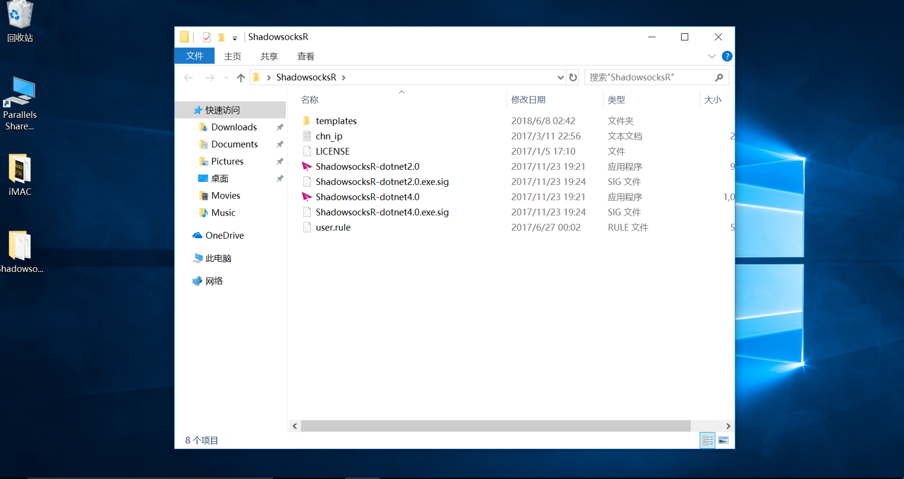
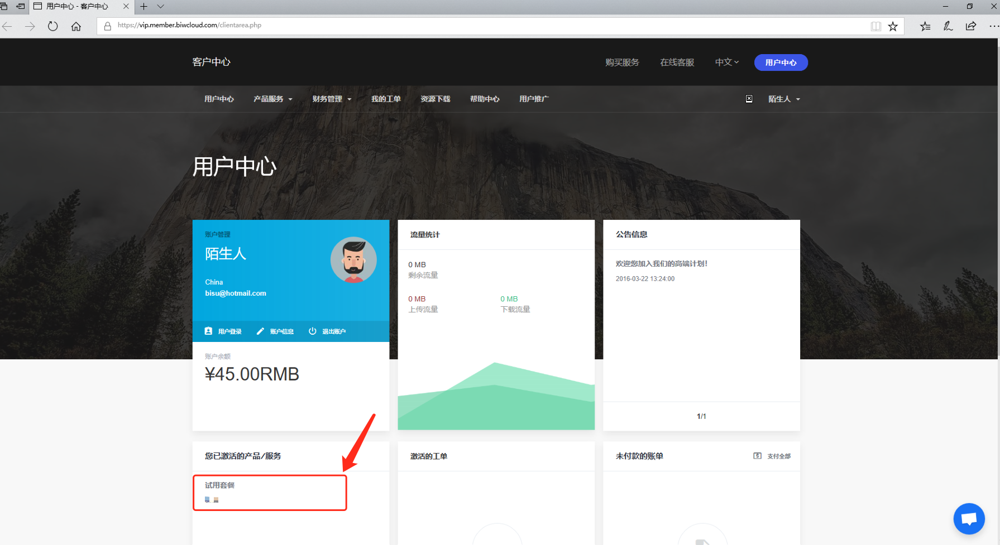
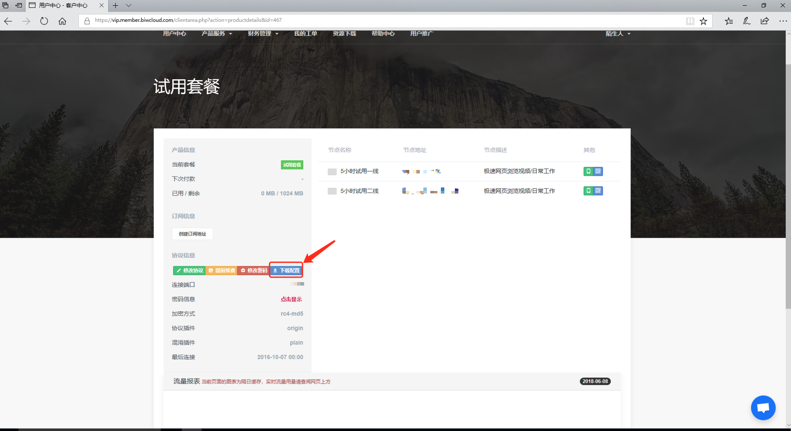
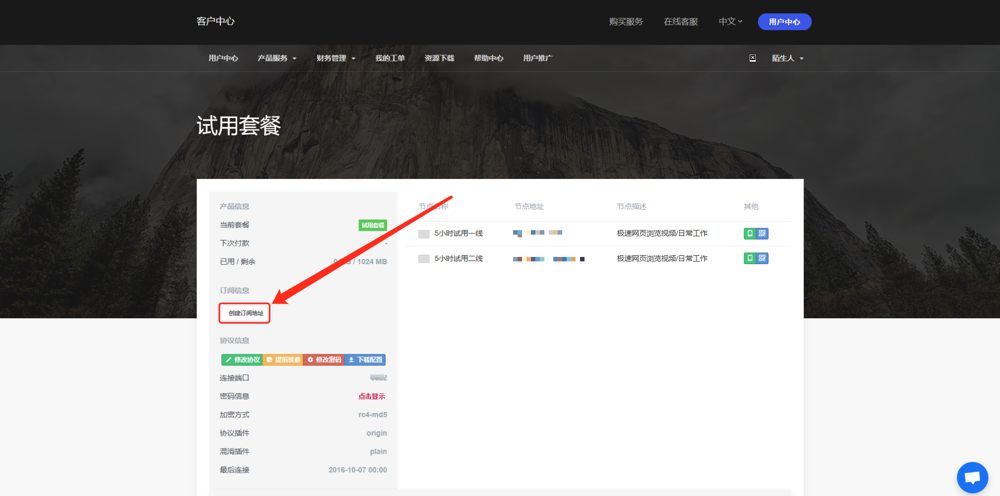

# Windows

## ShadowsocksR C-sharp {#shadowsocksr-c-sharp}

ShadowsocksR（以下简称为 SSR） Windows 客户端是 @breakwa11 开发的，可支持 SSR 全部特性的 Windows 客户端。

`目前由于 @breakwa11 已经停止对 SSR 的开发，因此 我们 也已经停止对此客户端的主流支持，转为扩展支持。`


此文档中的系统环境

`Windows 10 Pro Version 1709 x64`


### 软件下载

地址：[**ShadowsocksR-win-4.9.0.zip**](https://github.com/shadowsocksrr/shadowsocksr-csharp/releases/download/4.9.0/ShadowsocksR-win-4.9.0.zip)

解压后放到任意位置，如我们为了方便使用直接解压到桌面上到**ShadowsocksR**文件夹中

### 配置下载

打开客户中心登陆后进入用户首页，然后在`激活的产品`点击进入。

  
在`协议信息`里面点击`下载配置`下载配置文件

将下载的配置文件`gui-config.json`复制到软件到根目录（之前解压到的那个目录）


我们建议使用Google Chrome或IE9以上（当然也包括Edge）下载文件。

如果您之前下载过配置文件请将之前在浏览器下载目录中配置文件删了在下载

请注意下载到配置文件目录是否为`gui-config.json`


### 开始使用

打开客户端即可开始加速。


如果您的系统为win7请打开`ShadowsocksR-dotnet2.0.exe`

win7以上的系统版本请打开`ShadowsocksR-dotnet4.0.exe`


## SSTap\(游戏加速\) {#sstap}

你可以点击[这里](http://cdn.biwcloud.com/SSTap.exe)下载SSTap 安装程序

### 安装SSTap

安装过程中将可能提示：

无需担心，这是因为 SSTap 需要使用 OpenVPN 的 TAP 设备驱动来创建虚拟网卡以实现类似 VPN 的效果。为了 SSTap 能正常运行，请点击「安装」。

### 创建订阅链接

进入客户中心登陆后进入用户首页，然后在`激活的产品`点击进入，点击`创建订阅地址`

创建完订阅地址后，刷新一次页面然后点击`复制`订阅地址

###  **配置 SSTap**

打开 SSTap，在主界面如图所示位置点击齿轮图标。（SSTap 的运行需要管理员权限）  

在弹出的菜单中选择「SSR 订阅」 - 「SSR 订阅管理」

在新的窗口中，将刚才复制的`订阅地址`粘贴到「URL」中，然后点击「添加」。

  
完成后，关闭 SSR 订阅管理的窗口，SSTap 将会自动识别 我们的 订阅并添加接入点到 SSTap 中。

节点订阅添加后，在「代理」中选择所需的接入点，然后在「模式」中选择所需的模式，一般我们选择「不代理中国 IP」。


SSTap 虽然宣称为游戏而生，但 我们的 接入点均没有为游戏加速优化，因此我们不对游戏加速性能提供任何保障。


完成后，点击「连接」即可通过 SSTap 连接到 我们的 服务器。连接成功后 SSTap 会自动最小化。

你可以通过 SSTap 自带的连接测试来查看连接是否正常。使用方法是点击「代理」右侧的闪电图标。

##  Hyper-V 虚拟机

### 软件信息


此文档需要阅读者拥有一定的计算机知识以理解其中的专业术语。


`我们 为此使用方法提供「主流支持」，Yeah~`

Hyper-V 是 Windows 系统内置的「完全虚拟化」解决方案，Hypervisor 运行在 CPU 的 Ring -1 上。

启用 Hyper-V 时要求计算机上不能运行有其他 Hypervisor（如 VMware Workstation）。此外，在启用 Hyper-V 后也不能再运行其他 Hypervisor 软件（但是可以通过 VT-x Pass-through 来在 Hyper-V 的虚拟机内使用其他 Hypervisor，虽然这会影响效率）。

某些认证计算机硬件或硬件序列号的软件拒绝在虚拟机环境下运行，由于开启 Hyper-V 后，你的宿主系统就成为了一个在 Hyper-V 上运行的特殊虚拟机，因此有此类软件使用需求的用户请勿尝试此方案。

### 安装 LEDE 


使用 Hyper-V 可能影响你的计算机正常使用



此文档篇幅较长，并且需要严格按照文档中的每一个步骤来操作


#### 安装前检查 {#安装前检查}

要使用 Hyper-V，首先必须确保你的 CPU 支持硬件虚拟化技术。这项技术在 Intel 平台被称之为 `VT-x`；在 AMD 平台被称之为 `AMD-V`。

此外，为了达成最佳性能，建议同时打开 I/O 设备虚拟化技术。这项技术在 Intel 被称之为 `VT-d`；在 AMD 平台被称之为 `AMD-Vi`。

如果你的 CPU 不支持硬件虚拟化技术，则不能使用 Hyper-V。

#### 系统环境 {#此文档中的系统环境}

`Windows 10 Pro 1709 64位  
Hyper-V Hypervisor`

#### 启用 Hyper-V {#启用-hyper-v}

在最新版的 Windows 10 1709 系统中，依次点击 开始菜单 - 设置 - 应用 - 程序和功能打开控制面板。

你也可以直接打开「控制面板」，然后依次点击 程序 - 程序和功能。

点击「启用或关闭 Windows 功能」，打开 Windows 功能管理窗口，并勾选「Hyper-V」。

点击「确定」，Windows 会自动开启 Hyper-V 功能并要求重启计算机。

#### 配置 Hyper-V {#配置-hyper-v}

重新启动计算机后，通过任务栏的「搜索」功能搜索 Hyper-V 管理器。

你可以将 Hyper-V 管理器固定在任务乱或开始菜单以方便下次使用。

打开 Hyper-V 管理器后，点击「虚拟交换机管理器」

Hyper-V 会打开新的窗口以显示虚拟交换器管理器，在新的窗口中点击「创建虚拟交换机」，在类型中选择「外部网络」。

我们首先创建用于外部网络的虚拟交换机，这个交换机相当于你路由器的 `WAN` 接口，用于将路由器连接到外部网络。

在名称中输入「外部网络」（或其他你喜欢的名称），将虚拟交换机设置为「外部网络」连接类型，并在下方的菜单中选择你目前用于连接到外部网络的网络设备，这可能是有线网卡或无线网卡。

由于我们目前尚未完成所有工作，因此先将这个外部虚拟交换机设置为「允许管理操作系统共享此网络适配器」。

使用无线网卡会存在性能问题

之后，我们继续创建第二个虚拟交换机，类型选择「内部网络」。

这个虚拟交换机是用于给虚拟化宿主机提供来自软路由的网络的，因此类型只需要选择「内部网络」。

如果你不需要将这个软路由作为一个真正的路由器使用，那么目前关于虚拟交换机的工作就已经完成了。如果你需要将这个软路由的网络提供给其他设备，并且有多个物理网卡，只需要按照之前的步骤，为每个物理网卡添加一个类型为「外部网络」的虚拟交换机，但需要将「允许管理操作系统共享此网络适配器」取消勾选。

使用 VLAN / VXLAN 以在一个物理网卡上实现单臂路由的方法不在本文档的覆盖范围内。

#### 创建 LEDE 虚拟机 {#创建-lede-虚拟机}

首先你需要下载适用于 Hyper-V 的 LEDE 硬盘映像。目前 Koolshare 提供的是 RAW 格式的硬盘映像，因此你需要使用工具来进行转换。不过，我们 提供了一些已经转换过的映像可以直接被使用。

[点击这里访问](https://seryox.com/LEDE/) 下载

下载完成后，打开 Hyper-V 管理器，点击「新建」-「虚拟机」，将会打开一个新的窗口。

虚拟机的名称可以随意设置。

选择虚拟机技术世代，必须选择「第一代」

为虚拟机分配内存，推荐至少 256MB，并去除「为此虚拟机使用动态内存」的勾选。

为虚拟机分配第一个网络适配器，选择之前创建的「内部网络」。

为虚拟机创建硬盘，我们无需为 LEDE 创建硬盘，只需要选择之前下载的 LEDE 硬盘映像即可。

完成虚拟机创建后，点击右侧的「设置」

首先需要为虚拟机添加第二个或更多网络适配器。

将我们之前创建的「外部网络」指派给新的网络适配器。如果你添加了多个虚拟交换机，则需要一一添加网络适配器并指派给它们。

依次点击网络适配器上的 `+` 号，选择「高级功能」，勾选「启用 MAC 地址欺骗」。

不开启此功能将导致之后软路由下的设备无法上网

然后，点击「IDE 控制器」下的「硬盘驱动器」，找到我们添加的 LEDE 虚拟硬盘，然后点击「编辑」。

在新的窗口中选择「扩展」。

为硬盘设置新的容量，推荐至少 1GB。

所有操作完成后，点击保存，然后再次打开虚拟交换机管理器，将刚才设置的「外部网络」虚拟交换机的「允许管理操作系统共享此网络适配器」勾选去除。

这将会导致宿主机立即失去网络连接

请确保已经保存所有所需操作，并确保本文档的所有内容和图片已经加载完毕。

保存对虚拟交换机所作出的更改，返回到 Hyper-V 管理器。

选择刚才创建的 LEDE 虚拟机，点击右侧的「启动」。

虚拟机启动后，点击右侧跑的「连接」打开虚拟机视屏界面，当出现类似图中的信息时表明 LEDE 虚拟机已经成功启动。

#### 设置内部网络 {#设置内部网络}

打开适配器管理页面，要打开此页面，你可以使用以下两种方法：

1. 依次点击 开始菜单 - 设置 - 网络和 Internet - 更改适配器选项
2. 打开「网络和共享中心」，点击「更改适配器设置」

找到名称为「vEthernet（内部网络）」的网络适配器，然后点击「更改此连接的设置」以打开设置页面。

点选「Internet 协议版本 4（TCP/IPv4）」，然后点击「属性」。

在新的窗口中进行如下设置：

> IP 地址：`192.168.1.2`
>
> 子网掩码：`255.255.255.0`
>
> 默认网关：`192.168.1.1`
>
> 首选 DNS 服务器：`192.168.1.1`

点击「确定」保存所有设置。

完成之前的步骤后，打开浏览器，并在地址栏中输入 `192.168.1.1` 以打开 LEDE 管理页面。

由于 Koolshare LEDE 的页面存在一些兼容性问题，建议使用 Google Chrome 浏览器

默认的管理后台密码是：`koolshare`

如果一切顺利，你应当可以看到类似页面：

恭喜！你已经成功在虚拟机上安装了 LEDE 作为软路由！

#### [配置 LEDE 的网络](https://docs.rixcloud.us/Windows/Hyper-V/Install-LEDE/?id=%e9%85%8d%e7%bd%ae-lede-%e7%9a%84%e7%bd%91%e7%bb%9c) {#配置-lede-的网络}

依次点击侧边栏的 网络 - 接口

你可以看到一个绿色的网络接口名称为「br-lan」。如果有两个多余的红色 `WAN` 和 `WAN6` 接口，请点击「删除」来删除它们。

在绿色的 `br-lan` 接口上点击「修改」。

在新的页面中点击「物理设置」，然后将「接口」部分中除 `eth0` 以外的接口全部取消勾选。

设置完成后点击下方的「保存并应用」，稍后页面将会自动跳转。

返回到接口管理页面后，点击「添加新接口」。

在新的页面中，为此接口名称设置为 `WAN` 或者你喜欢的名称，然后根据你的实际情况选择接口协议，如 PPPoE 或 DHCP 客户端。

在「包括以下接口」部分勾选 `eth1`。

完成后点击「保存并应用」，进入详细设置。

在「基本设置」中配合你的外部网络连接方式，如输入你的 PPPoE 账号等。

然后点击「防火墙设置」，将新的接口防火墙区域设置为 `WAN`。`WAN` 区域使用红色作为标志。

全部完成后，点击「保存并应用」，将会返回到概览页面。

如果你的外部网络设置正确，此时应当已正确连上互联网。

#### [修改 LEDE 管理后台密码](https://docs.rixcloud.us/Windows/Hyper-V/Install-LEDE/?id=%e4%bf%ae%e6%94%b9-lede-%e7%ae%a1%e7%90%86%e5%90%8e%e5%8f%b0%e5%af%86%e7%a0%81) {#修改-lede-管理后台密码}

依次点击 系统 - 管理权。

设置新的后台密码。

确认无误后，点击「保存并应用」。

### LEDE配置 

关于此部分内容，请点击这里参考另一篇支持文档。  

