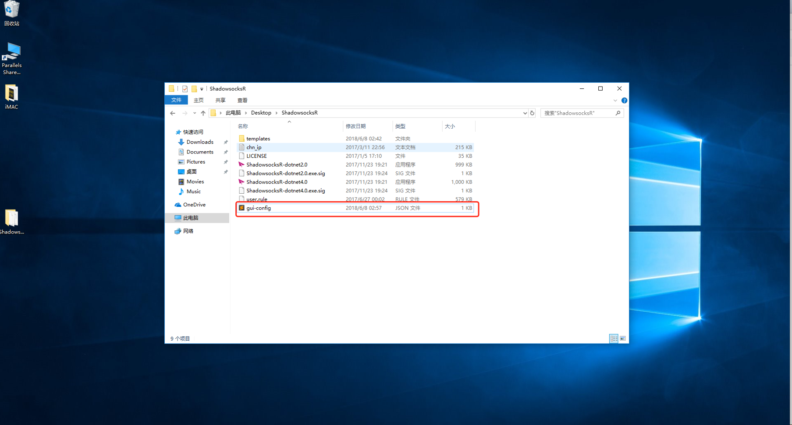

# Windows

## ShadowsocksR C-sharp {#shadowsocksr-c-sharp}

ShadowsocksR（以下简称为 SSR） Windows 客户端是 @breakwa11 开发的，可支持 SSR 全部特性的 Windows 客户端。

`目前由于 @breakwa11 已经停止对 SSR 的开发，因此 rixCloud 也已经停止对此客户端的主流支持，转为扩展支持。`


此文档中的系统环境

`Windows 10 Pro Version 1709 x64`


### 软件下载

地址：[**ShadowsocksR-win-4.9.0.zip**](https://github.com/shadowsocksrr/shadowsocksr-csharp/releases/download/4.9.0/ShadowsocksR-win-4.9.0.zip)

解压后放到任意位置，如我们为了方便使用直接解压到桌面上到**ShadowsocksR**文件夹中

### 配置下载

打开客户中心登陆后进入用户首页，然后在`激活的产品`点击进入。

  
在`协议信息`里面点击`下载配置`下载配置文件

将下载的配置文件`gui-config.json`复制到软件到根目录（之前解压到的那个目录）


我们建议使用Google Chrome或IE9以上（当然也包括Edge）下载文件。

如果您之前下载过配置文件请将之前在浏览器下载目录中配置文件删了在下载

请注意下载到配置文件目录是否为`gui-config.json`


### 开始使用

打开客户端即可开始加速。


如果您的系统为win7请打开`ShadowsocksR-dotnet2.0.exe`

win7以上的系统版本请打开`ShadowsocksR-dotnet4.0.exe`


